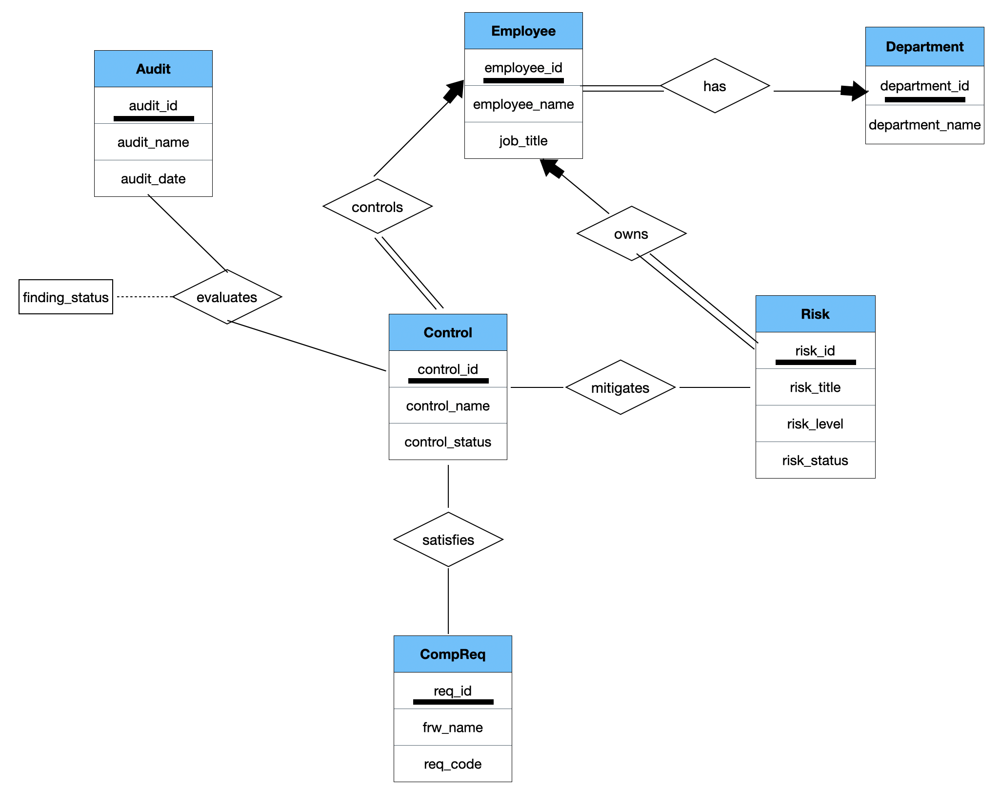
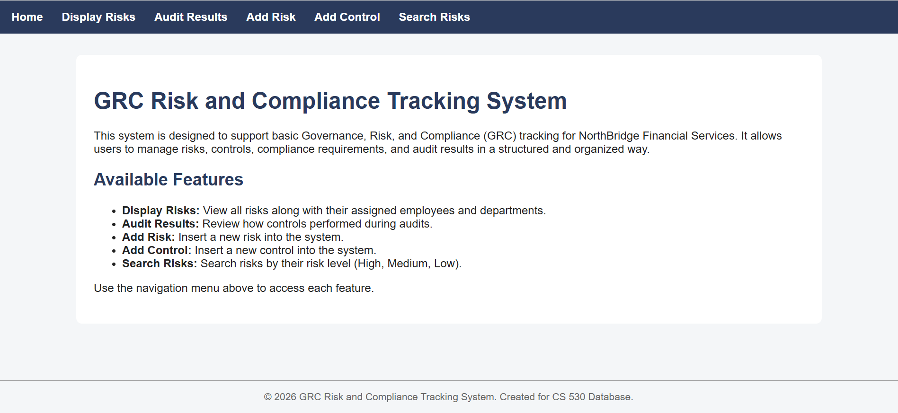
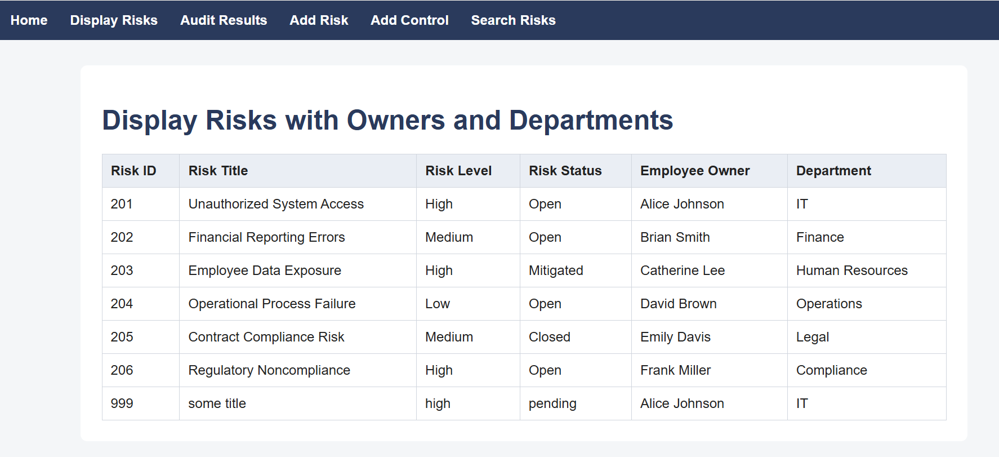
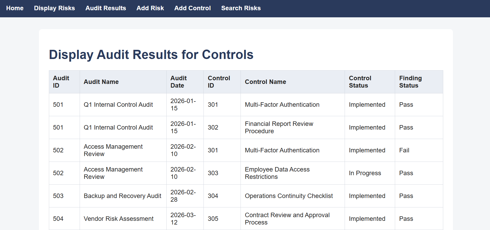
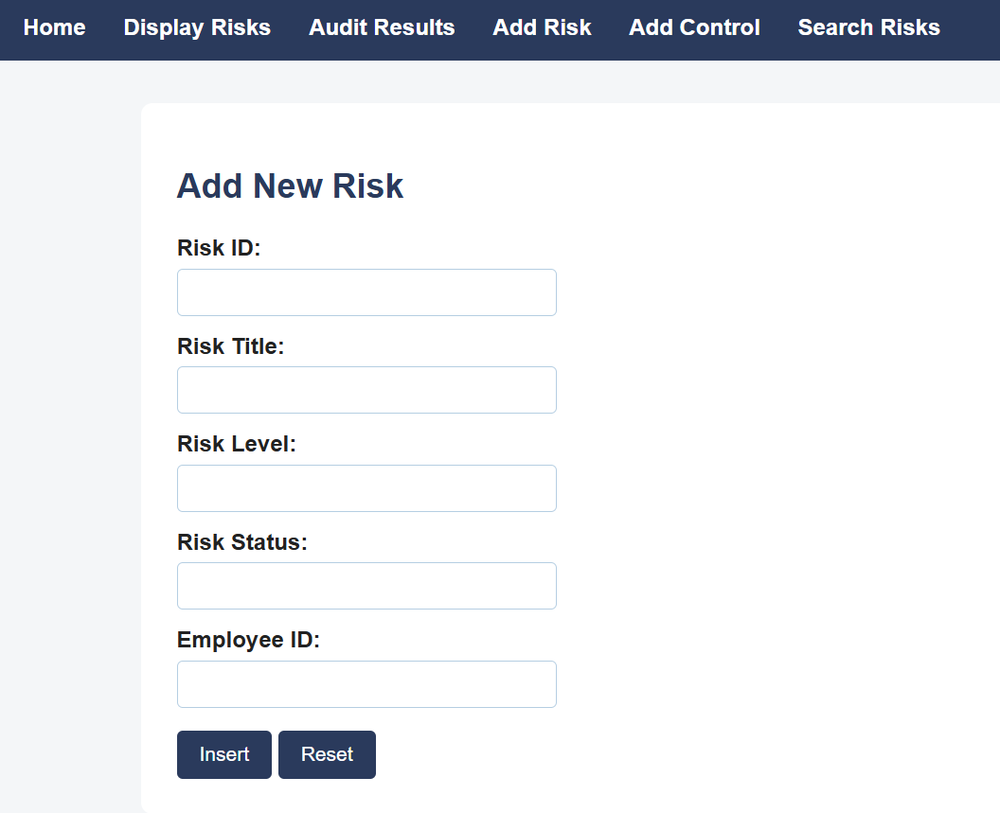
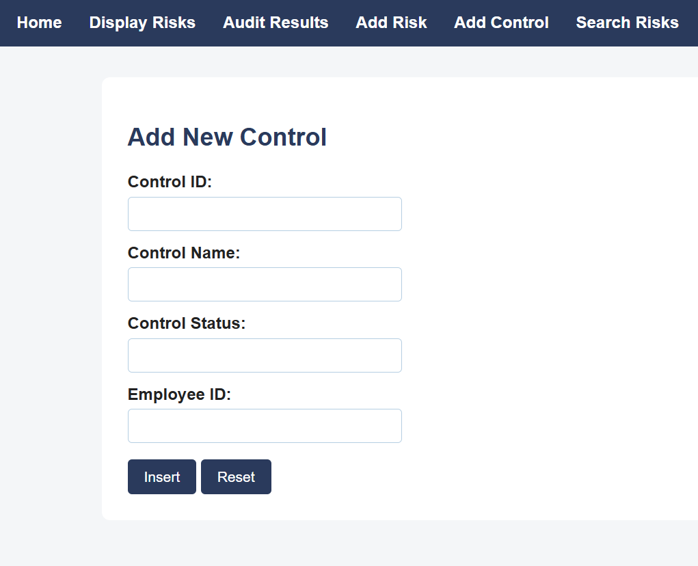
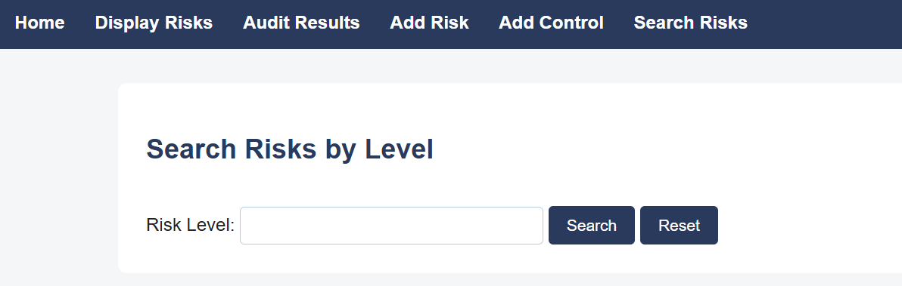

# GRC Risk and Compliance Tracking System

## Project Overview

The GRC Risk and Compliance Tracking System is a relational database application designed to help organizations manage Governance, Risk, and Compliance (GRC) information in a structured and accountable manner.

Many organizations track risks, controls, compliance requirements, and audit results in separate systems, spreadsheets, or documents. This makes it difficult to understand how risks are mitigated, whether controls are effective, and who is responsible for compliance activities.

This project addresses that challenge by integrating these elements into a single relational database system with a web-based interface.

---

## Objectives

* Track organizational risks
* Assign ownership and accountability
* Manage internal controls
* Store compliance requirements
* Record audit results
* Support risk and compliance reporting

---

## Database Design

The system is built around six core entities:

* Department
* Employee
* Risk
* Control
* Compliance Requirement
* Audit

The design also includes associative relations to model many-to-many relationships:

* Mitigates
* Satisfies
* Evaluates

The ER diagram and relational schema are included in the repository.

---

## Technologies Used

* MySQL
* PHP
* HTML
* CSS
* SQL
* PDO Database Connectivity

---

## Application Features

### Home Page

Main navigation page for the application.

### View Risks

Displays risks together with their assigned employee owner and department.

### View Audit Results

Displays audit findings for controls, including audit information and evaluation status.

### Add Risk

Allows users to insert new risk records into the database.

### Add Control

Allows users to insert new control records into the database.

### Search Risks

Allows users to search risks by risk level.

---

## Repository Structure

* `/php` – PHP application files
* `/sql` – Database creation and sample data scripts
* `/er-diagram` – Entity Relationship Diagram
* `/documentation` – Design and analysis documents
* `/presentation` – Project presentation
* `/screenshots` – Application screenshots

---

## Key Design Decisions

Several design decisions were made to improve data integrity, accountability, and normalization.

- Risks are assigned to employees rather than directly to departments. Department ownership can be derived through the employee relationship, avoiding redundancy.

- Audit findings are stored in the Evaluates relationship rather than the Control entity itself. This preserves historical audit results because the same control may be audited multiple times.

- Foreign key constraints enforce referential integrity and prevent orphaned records.

- The schema was normalized to reduce redundancy and maintain consistency across related entities.

---

## Lessons Learned

This project reinforced the importance of proper database normalization, foreign key constraints, and relational modeling. It also demonstrated how database design decisions directly affect application functionality and long-term maintainability.

---

## Future Enhancements

Future versions could include dashboards, reporting capabilities, and executive-level analytics.

Examples of questions the system could support include:

- How much potential financial risk is currently exposed due to controls that failed their most recent audit?

- Which compliance requirements have the highest number of unresolved audit findings?

- Which departments own the greatest concentration of high-risk issues?
